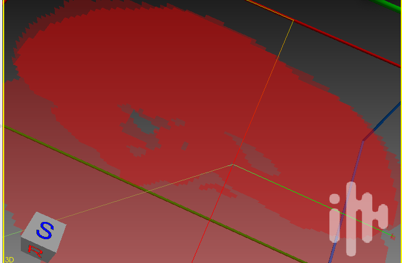

# TRK

The [TrackVis TRK format](https://trackvis.org/docs/?subsect=fileformat) is a popular format for tractography streamlines. One unusual feature of this format is that it uses [voxel corners](https://github.com/nipy/nibabel/blob/0e925abb15e2dfbeecaaca4e7c2479b9d3e2cec0/nibabel/streamlines/trk.py#L90) as the origin, while most neuroimaging formats like [NIfTI](https://nifti.nimh.nih.gov/pub/dist/src/niftilib/nifti1.h) use the voxel center. This can lead to streamlines being translated by half a voxel if the TRK reader does not adjust the coordinates.

The Python script ` make_tck.py` allows a developer to specify a streamline in world coordinates which are saved as a [TCK format](https://mrtrix.readthedocs.io/en/dev/getting_started/image_data.html#tracks-file-format-tck) file. The TCK format is explicit about world coordinates, and is independent of voxel sizes. The script `convert_tck_to_trk.py` from [brainlife](https://github.com/brainlife/app-convert-tck-to-trk) uses nibabel to convert the TCK file to TRK file uses the voxel space of the NIfTI image MNI152_T1_2mm_brain_mask.nii.gz. You can run the scripts with the following commands:

```
git clone git@github.com:neurolabusc/TRK.git 
cd TRK
python make_tck.py
python convert_tck_to_trk.py
```

Note that the provided NIfTI image is a black and white binary image, where the origin (0x0x0) is a black dot surrounded by white and the voxel at 0x74x0 is a white dot surrounded by black. As provided, the scripts will draw two orthogonal streamlines that interset at the origin (0x0x0). One of the streamlines terminates at 0x74x0.

A tool that interprets the TRK file correctly should show the streamlines precisely at the middle of the two dots. For example, [mi-brain](https://github.com/imeka/mi-brain/releases/tag/2020.04.09) shows the expected result:




